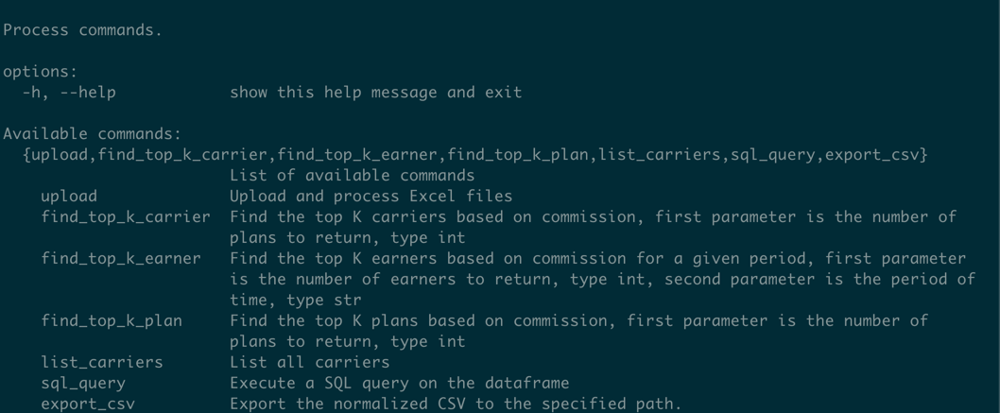
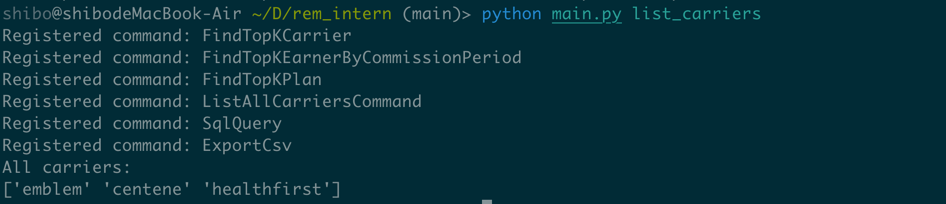

# TODO
- Export command: save databse to CSV file to 制定的地址
- cli interface: 

# Using Guid
- 

# Goal of this project
- Build a data pipeline that do ETL process, extract, transform, load

# Component 
- Input data are any kind of excel files
- Along with metadata file, in this case is the yaml_config file that allows user to explain the data schema
- If user did not give metadata, CLI will ask user to input the schema
- Output data are the normalized data saved in csv file
- Consider this csv file as the visualization of the database
- Minimum requirement is to support query for scenarios:
  - top 10 agents or agencies by commission payout across all the carriers, for commission period June 2024.
  - for future extensibility, the data schema should be designed to support other querying like top 10 agents or agencies by commission payout for a specific carrier, for a specific commission period, etc.
  - Fixed base schema for supporting query will need 4 columns:
    - Earner Name, Commission Amount, Commission Period, Earner Type

# Assumptions made on business and data model
- FMO is liaison between insurance carrier and agents, therefore, we need earner_type column to distinguish between agents, agencies and FMO
- Agents and FMOs receive commissions when a beneficiary is enrolled into a health plan

# ETL Process
- Extract: Extract the data from the given input CSV file.
- Transform: Normalize the data to the format specified in the metadata.
  - Normalize Sequences:
    - Mapping the column fro input data to designed fixed schema
    - Align data type of each column to the fixed schema
    - Logic process:
      - Earner Type:
      - Earner Name:
        - If the data is for agents, the earner name is the agent name
        - If the data is for agencies, the earner name is the agency name
        - If the data is for FMOs, the earner name is the FMO name
- Load: Load the data into the database. (In this case, we save the normalized data to a CSV file)

# Structure Design
- CLI acts as the front-end of the application, allow each customer to upload his own data

# Explanation of each folder
- data: store the input data
- database: This is the FINAL OUTPUT
- src: acts as backend of the application, contains all the logic to process the data
- config: settings for the application
- yaml_config: store the metadata of the data schema uploaded by customer
- csv_output: store the normalized data, used for concatenating the data and write to the database

# API
- Consider both capability and extensibility
- Low-level API:
  - CLI sql command 
- Mid-level api 
  - CLI command customize sql query

# Screenshot

# Something Important
- If the user specifies a primary key in the metadata: Use it.
- If no primary key is specified: Automatically generate a composite primary key from all the mapped columns in the fixed schema.
